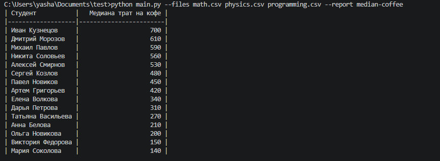

# Отчёт о потреблении кофе

CLI-скрипт читает несколько CSV-файлов подготовки к экзаменам и строит отчёт `median-coffee`: медианная сумма трат на кофе по каждому студенту за весь период (по всем переданным файлам), с сортировкой по убыванию.

Проект сделан с расширяемой архитектурой отчётов: новый отчёт добавляется отдельным классом в `coffee_reporter/reports` и регистрацией в `coffee_reporter/registry.py`.

## Пример запуска

```bash
python main.py --files math.csv physics.csv programming.csv --report median-coffee
```

Альтернатива:

```bash
python -m coffee_reporter --files math.csv physics.csv programming.csv --report median-coffee
```

Пример вывода:

```text
| Студент           |   Медиана трат на кофе |
|-------------------|------------------------|
| Иван Кузнецов     |                    700 |
| Дмитрий Морозов   |                    610 |
| Михаил Павлов     |                    590 |
...
```

Скрин запуска:



## Тесты

```bash
pytest
```
